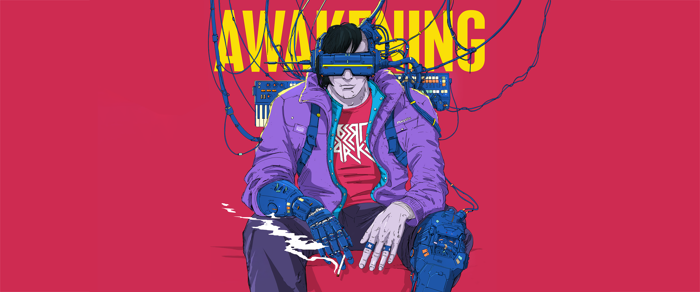
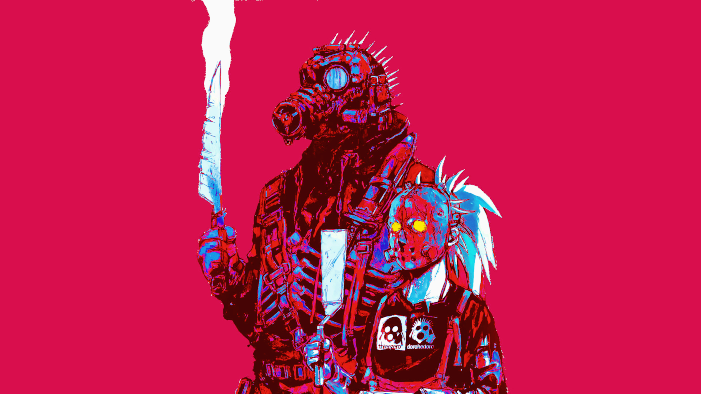
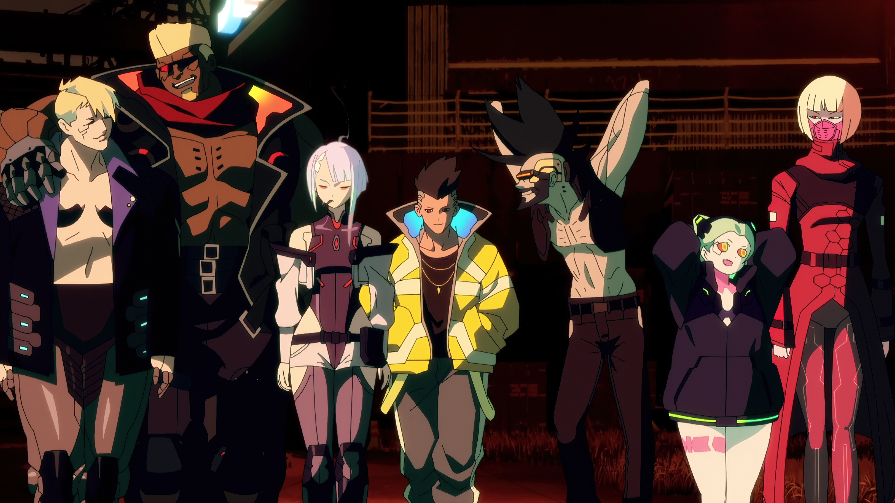
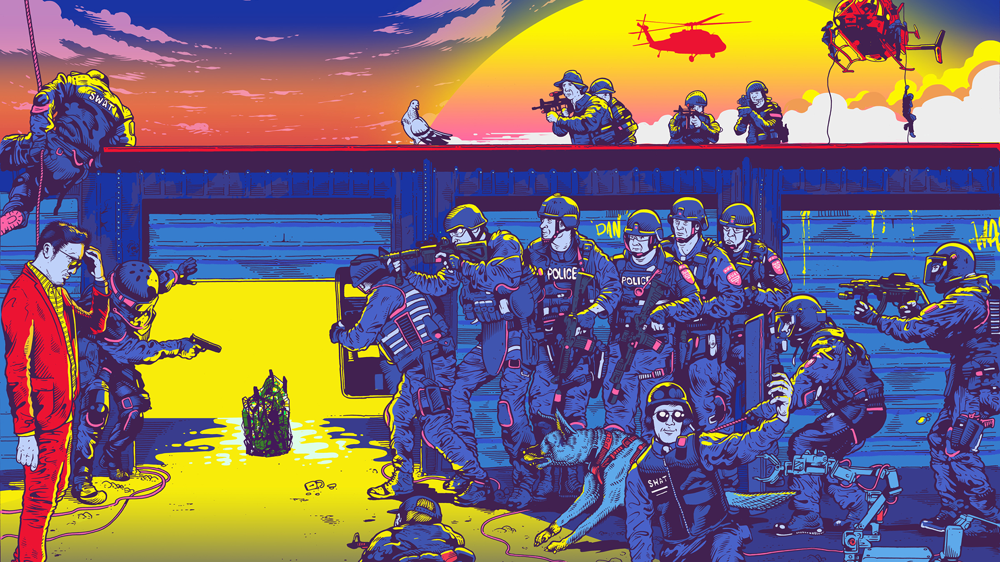

# Omarchy Awakening Theme

Awakening is a loud cyberpunk collage theme based on the cover art for Robert Parker's *Awakening*. It pulls from the album's neon pressure and graphic intensity, with extra influence from *Cyberpunk 2077: Edgerunners* and color themes like Elementary and Brogrammer.

## Preview


## Install

Use the Omarchy theme installer:

```bash
omarchy-theme-install https://github.com/OldJobobo/omarchy-awakening-theme
```

## What's Included

- Hyprland borders, opacity, blur, and animation tuning (`hyprland.conf`)
- Hyprlock styling (`hyprlock.conf`)
- Walker launcher styling (`walker.css`)
- GTK and Aether overrides (`gtk.css`, `aether.override.css`, `aether.zed.json`)
- Terminal palette coverage for Foot, Kitty, Ghostty, Alacritty, Warp, and Neovim (`foot.ini`, `kitty.conf`, `ghostty.conf`, `alacritty.toml`, `warp.yaml`, `neovim.lua`)
- System surfaces for notifications, OSD, browser tinting, icons, and resource tools (`mako.ini`, `swayosd.css`, `chromium.theme`, `icons.theme`, `btop.theme`, `cava_theme`)
- Discord theme coverage (`vencord.theme.css`)

## Wallpapers

<table>
  <tr>
    <td></td>
    <td></td>
    <td></td>
  </tr>
  <tr>
    <td></td>
    <td></td>
    <td></td>
  </tr>
</table>

## Requirements

- Omarchy
- The `Yaru-purple` icon theme selected by `icons.theme`

## Attribution

- Inspired by *Awakening* by Robert Parker: https://lazerdiscs.bandcamp.com/album/awakening
- Album cover art credited on the release page to Florian Renner: https://florian-renner.com
- Additional visual inspiration from *Cyberpunk 2077: Edgerunners*, Elementary, and Brogrammer
